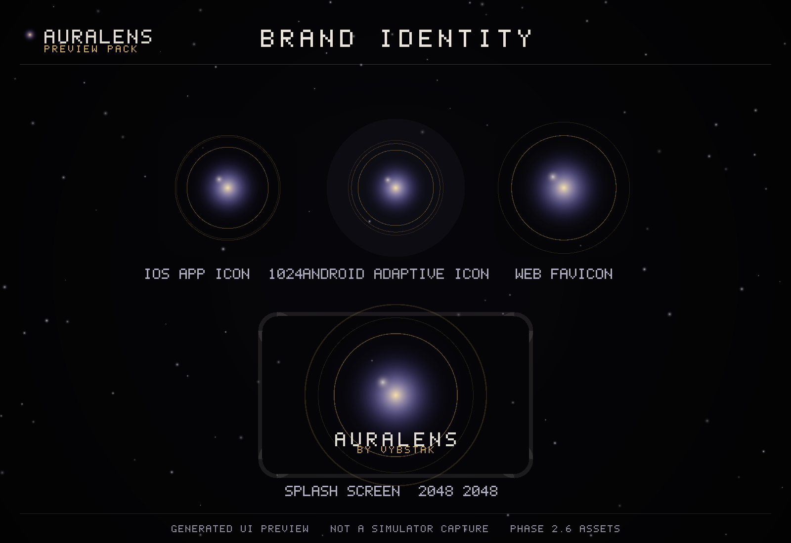
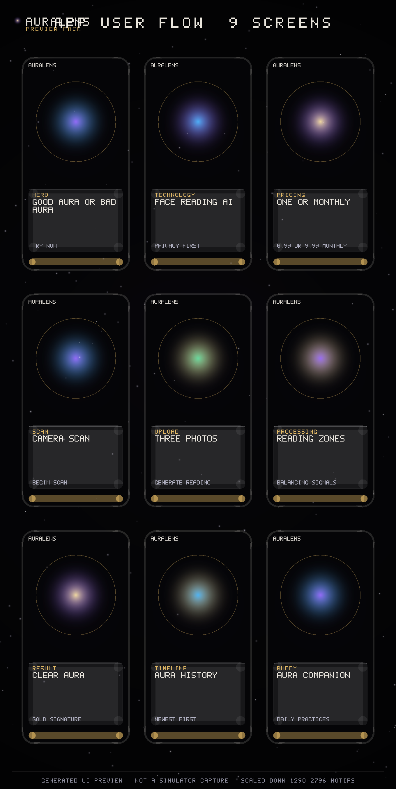
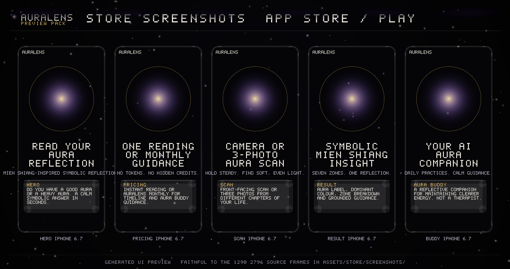
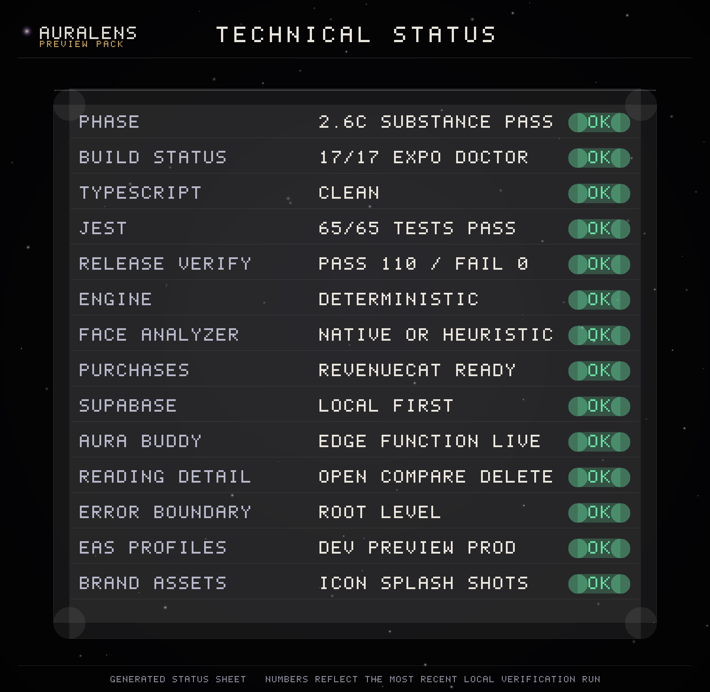

# AuraLens — preview gallery

> Visual review of the current AuraLens state.
> **Honest labelling**: nothing in this gallery is a real iOS or Android simulator capture. PNG sheets are generated by `npm run generate:preview`. HTML mockups are real-typography, real-CSS renderings of the React Native screens at iPhone 14/15 viewport (393×852) — closer to the production look, but still composed in CSS rather than captured from a running app. Real device captures will replace these once `eas build --profile development` produces a binary that runs on hardware.

To view everything live in a browser: `npm run preview` → http://localhost:4173/.

---

## 1. Brand identity

App icon, Android adaptive icon, web favicon, and the splash composition. Three-layer orb (gold core, violet halo, blue outer ring) with hairline gold rings and a soft particle field on obsidian.

Source PNGs: [`assets/icon.png`](../assets/icon.png) · [`assets/adaptive-icon.png`](../assets/adaptive-icon.png) · [`assets/splash.png`](../assets/splash.png) · [`assets/favicon.png`](../assets/favicon.png)

---

## 2. App user flow (9 core screens)

Scaled-down mocks of the nine primary user-facing surfaces in flow order:

1. **Hero** — *"Do you have a Good Aura or a Bad Aura?"*
2. **Technology** — face zones, landmark geometry, privacy first
3. **Pricing** — one-off vs monthly
4. **Scan** — front-camera capture with framing guides
5. **Upload** — three-photo selector
6. **Processing** — animated orb, status lines
7. **Result** — aura label, score, zone breakdown, guidance
8. **Timeline** — chronological history (monthly tier)
9. **Aura Buddy** — calm companion chat (monthly tier)

---

## 3. High-fidelity HTML screen mockups

Available live at `npm run preview` → http://localhost:4173/. Each renders in an iPhone-framed iframe with real system typography and CSS animations.

| Screen          | Open directly                                                  |
|-----------------|----------------------------------------------------------------|
| Hero            | [`/assets/preview/screens/hero.html`](../assets/preview/screens/hero.html) |
| Pricing         | [`/assets/preview/screens/pricing.html`](../assets/preview/screens/pricing.html) |
| Result          | [`/assets/preview/screens/result.html`](../assets/preview/screens/result.html) |
| Reading detail  | [`/assets/preview/screens/reading-detail.html`](../assets/preview/screens/reading-detail.html) |
| Compare         | [`/assets/preview/screens/compare.html`](../assets/preview/screens/compare.html) |
| Buddy           | [`/assets/preview/screens/buddy.html`](../assets/preview/screens/buddy.html) |
| Timeline        | [`/assets/preview/screens/timeline.html`](../assets/preview/screens/timeline.html) |

---

## 4. Store screenshots (App Store / Play)

The five 1290×2796 screenshots ready to upload to App Store Connect and Play Console. Each carries the brand mark, hero orb, headline, subline, glass body card, and the store-safe footer disclaimer.

| Frame    | Headline                          |
|----------|-----------------------------------|
| Hero     | Read Your Aura Reflection         |
| Pricing  | One Reading or Monthly Guidance   |
| Scan     | Camera or 3-Photo Aura Scan       |
| Result   | Symbolic Mien Shiang Insight      |
| Buddy    | Your AI Aura Companion            |

Sources: [`assets/store/screenshots/`](../assets/store/screenshots/)

---

## 5. Technical status

Live status of the verification gates as of the most recent local run. Now includes 65/65 tests, the new reading detail + compare screens, and the root error boundary.

---

## Asset inventory

| File                                                    | Dimensions  | Purpose                              |
|---------------------------------------------------------|-------------|--------------------------------------|
| `assets/icon.png`                                       | 1024 × 1024 | iOS / generic app icon               |
| `assets/adaptive-icon.png`                              | 1024 × 1024 | Android adaptive foreground          |
| `assets/splash.png`                                     | 2048 × 2048 | Splash screen                        |
| `assets/favicon.png`                                    | 196 × 196   | Web favicon                          |
| `assets/store/screenshots/hero-iphone-6.7.png`          | 1290 × 2796 | App Store / Play screenshot          |
| `assets/store/screenshots/pricing-iphone-6.7.png`       | 1290 × 2796 | App Store / Play screenshot          |
| `assets/store/screenshots/scan-iphone-6.7.png`          | 1290 × 2796 | App Store / Play screenshot          |
| `assets/store/screenshots/result-iphone-6.7.png`        | 1290 × 2796 | App Store / Play screenshot          |
| `assets/store/screenshots/buddy-iphone-6.7.png`         | 1290 × 2796 | App Store / Play screenshot          |
| `assets/preview/brand-preview.png`                      | 1600 × 1100 | Generated brand preview              |
| `assets/preview/app-flow-preview.png`                   | 1360 × 2700 | Generated app-flow preview           |
| `assets/preview/store-screens-preview.png`              | 2160 × 1140 | Generated store-screens preview      |
| `assets/preview/technical-status.png`                   | 1600 × 1560 | Generated status sheet               |
| `assets/preview/screens/*.html`                         | 393 × 852   | High-fidelity HTML mockups (7 screens) |

---

## Honest caveats

- All preview sheets and HTML mockups are generated. None of them are captures from a real iOS or Android simulator. They are **faithful representations** that use the same colour tokens, copy, layout, animation, and brand composition as the production app.
- Final brand artwork (commissioned or hand-designed in Figma) should drop straight over the four asset PNGs with the same dimensions — the [brand guide](./brand-guide.md) locks the composition cues.
- For genuine iOS / Android screenshots, run `eas build --profile development --platform ios` (or `android`), install the dev client, and capture screenshots from the running app. Those will replace the mock store frames before App Store / Play submission.
